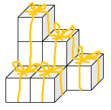
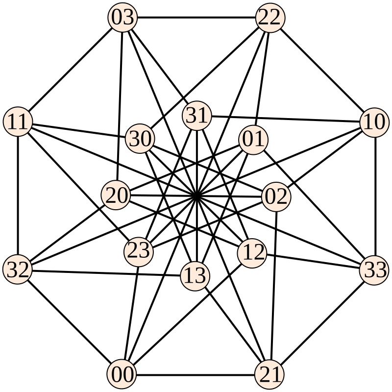


この記事は[組合せ論 Advent Calendar 2024](https://adventar.org/calendars/10062) の 25 日目の記事です。

いよいよアドベントカレンダーも最終日ですね。そして、今日はクリス Math ですね。

良い子にしていたみなさんにプレゼントボックスを用意しました！

うーん、並べ方が気に入らないですね……。

こんな並べ方はできないでしょうか？

- 単位立方体の箱で空間を敷き詰める。
- どの 2 つの箱も、接する部分が単位正方形になることはない。

2 つ目の条件については、接する部分が単位正方形より小さい図形になることはよいものとします。

実はこのような並べ方はできないことが証明されています。つまりどのように箱を敷き詰めても、ある 2 つの箱はぴったり面がくっついているということです。

## Keller の予想

Keller の予想はこれを高次元に一般化したものです。


**予想**: $d$ 次元単位立方体で空間 $\mathbb{R}^d$ を敷き詰めるとき、どの 2 つの立方体も接する部分が $(d-1)$ 次元単位立方体にならないように敷き詰めることはできない。


驚くべきことに、この予想は $d\le 7$ で成立し、$d\ge 8$ で成立しないことがわかっています。つまり 8 次元以上ではうまく敷き詰められるということです。

## Keller グラフ

空間に立方体を敷き詰めるという問題は考えにくいですが、この問題を組合せ論的な議論に帰着させることができます。

論文にアクセスできなかったので間違ったことを書いているかもしれませんが、Keller グラフというものを考えると、このグラフにサイズ $2^d$ のクリークが存在しないことが Keller の予想と同値になるそうです。

例えば $d=2$ のとき Keller グラフは次のようになるそうです。(Wikipedia より。By David Eppstein - Own work, CC0)

このグラフにサイズ 4 のクリークはないので、2 次元での Keller の予想は成立します。

## 7 次元の場合

Keller の予想は $d=7$ の場合が最後まで残っていました。これが解決されたのは 2020 年頃のようです。

証明にはコンピュータによる計算が使われています。SAT などが使われているようです。コンピュータによる証明というと四色定理を思い出しますね。あの時代はコンピュータによる証明は特殊でしたが、現代ではよくあることになっています。

とはいえ人間でもわかる証明も欲しいですね。

## おわりに

複雑な問題を組合せ論に帰着させて解くという手法は面白いですね。難しい現代数学をパズルゲーム化していきたいです。

組合せ論 Advent Calendar 2024 はこれで閉幕となります。ご参加ありがとうございました。来年も開催する予定です。来年はもっと参加者を増やしたいです。そのためにも布教活動を頑張ります。
