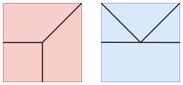


この記事は[物理学アドベントカレンダー2024](https://adventar.org/calendars/10569) の 12 日目の記事です。

最近見かけた数理物理のプレプリントが面白そうだったので共有します。

## 折り紙

みなさんは折り紙してますか？私も折り紙をしたいです。

折り紙を折ったあとに展開すると、折り目がついています。逆に折り目が与えられたとき、それに沿って折り紙を折ることができるかを考えてみます。例えば次のような折り目はできるでしょうか？

ここで折り紙の定義を明確にしておきます。この記事で扱う折り紙は「平坦折り紙」です。立体的な折り紙作品もありますが、今回は平面の紙から始めて、完成形も平面状なものとします。さらに、直線に沿って山折りまたは谷折りのみを行うものとし、特殊な折り方はしません。

以下のような定理が成り立ちます。


**定理** (前川定理): 折り目の交点について、山折りの線の数と谷折りの線の数の差は $\pm 2$ である。


このことから折り目の交点からは偶数本の折り目が伸びていることになります。つまり上の赤い図は折り紙の折り目にはならないということですね。

さらに次のような定理もあります。


**定理** (川崎定理): 折り目の交点について、1 つおきに角度を足したときの和は 180 度である。


青い図の方もダメということです。

## t-はめ込みと t-埋め込み

平面折り紙の折り目模様が与えられたとき、各領域は完成形において上を向くか下を向くかの 2 種類に分けられます。これに従って領域を白・黒で塗り分けることができます。これは二部グラフの双対であるとみなせます。この議論の逆向きを考えます。

$(\Gamma,\mathrm{wt})$ を平面的二部グラフで、$\mathrm{wt}$ は辺に正の実数の重みを与える関数であり、グラフは円板に埋め込まれたものとします。円周上の頂点の次数は 1 であるとします。$\Gamma^*$ を双対グラフとします。

大雑把に言うと、二部グラフから折り目模様を作りたいです。双対グラフから（複素）平面への写像 $\mathcal{T}\colon \Gamma^*\to\mathbb{C}$ を考えます。この写像が **t-はめ込み**であるとは

1. $\Gamma^*$ の辺の $\mathcal{T}$ による像は線分である。
2. $d$ 個の頂点をもつ面の像は凸 $d$ 角形であり、制限写像は向きを保つ。
3. $\Gamma^{\ast}$ の辺 $e^{\ast}=\\{v_1,v_2\\}$ に対して $\mathrm{wt} _ {\mathcal{T}}(e)$ を $\mathcal{T}(v_1),\mathcal{T}(v_2)$ 間の距離と定めると、$\mathrm{wt}$ と $\mathrm{wt} _ {\mathcal{T}}$ はゲージ同値である。
4. 内部の頂点について、白い角度の和・黒い角度の和は 180 度である。
5. 周上の頂点について、白い角度の和・黒い角度の和は 0 より大きく 180 度未満である。

をみたすことです。もう少し細かく解説します。$\Gamma$ の辺 $e$ と $\Gamma^{\ast}$ の辺 $e^{\ast}$ は一対一対応することに注意します。$\Gamma$ は二部グラフなので、$\Gamma$ の頂点は白黒で塗られ、$\Gamma^{\ast}$ の面も白黒で塗られます。$\mathcal{T}$ による面の像（2. より凸多角形）も白黒で塗られます。白い多角形の内角を白い角度と上では呼んでいます。また、2 つの重み $\mathrm{wt}_1,\mathrm{wt}_2\colon E\to\mathbb{R}^+$ がゲージ同値とは、ある $g\colon V\to\mathbb{R}^+$ が存在して、$\mathrm{wt}_2(\\{v_1,v_2\\})=g(v_1)g(v_2)\mathrm{wt}_1(\\{v_1,v_2\\})$ をみたし、かつ円周上の頂点に対する $g$ の値が 1 となることをいいます。

$\mathcal{T}$ が単射であるような t-はめ込みを **t-埋め込み** といいます。


**定理**: 任意の $(\Gamma,\mathrm{wt})$ は $t$-埋め込みをもつ。


この定理は最近のプレプリント

- Pavel Galashin, Amplituhedra and origami. [arXiv:2410.09574](https://arxiv.org/abs/2410.09574).

の結果です。これ以前には $\Gamma$ の円周上の頂点数が 4 の場合のみが証明されていたようです。

証明には (momentum) amplituhedron というものが使われています。これは散乱振幅という量子力学の概念を研究する中で生まれたもののようです。

## momentum amplituhedron

グラスマン多様体 $\mathrm{Gr}(k,n)$ は $\mathbb{R}^n$ の $k$ 次元部分空間からなる集合です。基底を考えることで、階数 $k$ の $k\times n$ 行列の集合と同一視されます。

全正値グラスマン多様体 $\mathrm{Gr}_{>0}(k,n)$ は、行列 $C\in \mathrm{Gr}(k,n)$ であって、任意の $I\in \binom{[n]}{k}$ に対してマイナー $\Delta_I(C)$ がすべて同符号であるものからなる集合です。

全非負グラスマン多様体 $\mathrm{Gr}_{\ge 0}(k,n)$ も同様に定義されます。ただし $\Delta_I(C)$ が 0 になってもよいものとします。

$\Lambda\in \mathrm{alt}(\mathrm{Gr} _ {>0}(n-k+2,n)),\tilde{\Lambda}\in \mathrm{Gr} _ {>0}(k+2,n)$ とします。ここで alt は偶数番目の列の符号を変えたものです。$C\in \mathrm{Gr} _ {\ge 0}(k ,n)$ に対して、$\Phi_{\Lambda,\tilde{\Lambda}}(C)=(C\cap \Lambda, C^{\perp}\cap \tilde{\Lambda})$ とします。$\Phi_{\Lambda,\tilde{\Lambda}}$ による $\mathrm{Gr} _ {\ge 0}(k,n)$ の像を momentum amplituhedron といいます。

## おわりに

折り紙という遊びが、momentum amplituhedron という物理の概念を使って研究されていると知ったときは面白いなと思いました。

もっとプレプリントの中身に踏み込めたり、背景となる物理の知識を解説できればよかったのですが、力及ばずでした。
