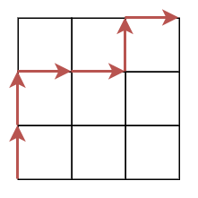

この記事は[日曜数学 Advent Calendar 2025](https://adventar.org/calendars/12125) の 7 日目の記事です。

日曜数学について、まずは個人的なことを中心に話そうと思います。私は今年の 6 月から働き始めました。その前は数学の修士課程に通っており、数学が本業でした。博士課程に進むかはかなり悩みましたが、結局行かないことにしました。今は働きながら数学の勉強をしたり記事を書いたりと、趣味の数学活動を続けています。今の私がやっていることは日曜数学と呼ぶにふさわしいのではないかと思いました。

これからも楽しく数学を続けていきたいと思います。できれば数学の世界で業績を残せたらいいなとも思います。

自分語りが長くなってしまいましたが、本題に移っていきます。私が魅力的に感じている数学のトピックを紹介します。

## カタラン数

次のような数え上げ問題を考えてみましょう。

$n$ 個の `(` と $n$ 個の `)` を使って、括弧の対応がとれている文字列を作る方法は何通りありますか？

例えば `(())()` は OK ですが `())(` はダメです。

この問題は次のようにして経路の問題に言い換えることができます。原点 $(0,0)$ から出発します。`(` があったら上に 1 つ進み、`)` があったら右に 1 つ進みます。`(())()` の場合次のような経路になります。



ゴールは $(n,n)$ になります。括弧の対応がとれているという条件は、経路が常に $y\ge x$ の領域にあるという条件に言い換えられます。

経路の問題に言い換えられましたが、この問題は「鏡像法」というテクニックで解くことができます。簡単にいうと $(0,0)$ から $(n,n)$ へのすべての経路から $y\ge x$ という条件をみたさない経路を除きますが、条件をみたさない経路が別の経路と一対一対応することを使います。これについて解説している記事はたくさんあるのでここでは省略しますが、答えは

$$
C_n=\binom{2n}{n}-\binom{2n}{n-1}=\frac{1}{n+1}\binom{2n}{n}
$$

となります。この数は**カタラン数**と呼ばれており、組合せ論では中心的な数です。ここでは括弧列の個数や $y\ge x$ の領域上にある経路の個数に等しいことを見ましたが、実は

- 二分木の個数
- 正多角形の三角形分割の個数
- 最長増加部分列の長さが 2 以下の順列の個数

など、様々なオブジェクトの個数に等しいことが知られており、そのようなオブジェクトは 100 種類を超えます。まさに「カタラン数は至る所にある！」ですね。

## q 類似

$q$ 類似は、大雑把にいうと $q\to 1$ の極限で元に戻るようなものです。

例えば非負整数 $n$ の $q$ 類似は $[n]_q=1+q+\cdots+q^{n-1}$ です。$q\to 1$ のとき $[n]_q\to n$ になります。こんなものはいくらでもあるじゃん、と思いますが、基本的にはこの $[n]_q$ が非負整数 $n$ の唯一の $q$ 類似として扱われます。

階乗 $n!$ の $q$ 類似は $[n]_q!=[1]_q[2]_q\cdots [n]_q$ として定義されます。さらに二項係数の $q$ 類似が

$$
\genfrac[]{0pt}0nk_q=\frac{[n]_q!}{[k]_q![n-k]_q!}
$$

により定義されます。

## カタラン数の q 類似

カタラン数の $q$ 類似を考えましょう。非負整数と二項係数の $q$ 類似を定義したので、それを用いて

$$
\frac{1}{[n+1]_q}\genfrac[]{0pt}0{2n}{n}_q
$$

と定義するのが自然に見えます。

しかし、カタラン数には別の $q$ 類似も知られています。それは

$$
\sum_{\pi}q^{\mathrm{area}(\pi)}
$$

です。ここで $\pi$ は $(0,0)$ から $(n,n)$ への経路であって領域 $y\ge x$ 上にあるもの全体を動くとし、$\mathrm{area}(\pi)$ は経路 $\pi$ と直線 $y=x$ で挟まれた領域内にあるマスの個数とします。（ただし、直線 $y=x$ により二等分されるマスは数えないものとします。）

さきほどの図の場合 $\mathrm{area}(\pi)=1$ です。


例を挙げましょう。便宜上、前者を $C_n^{\mathrm{binom}}(q)$、後者を $C_n^{\mathrm{area}}(q)$ と書きます。

- $C_1^{\mathrm{binom}}(q)=1$
- $C_2^{\mathrm{binom}}(q)=q^2+1$
- $C_3^{\mathrm{binom}}(q)=q^6 + q^4 + q^3 + q^2 + 1$
- $C_4^{\mathrm{binom}}(q)=q^{12} + q^{10} + q^9 + 2q^8 + q^7 + 2q^6 + q^5 + 2q^4 + q^3 + q^2 + 1$
- $C_1^{\mathrm{area}}(q)=1$
- $C_2^{\mathrm{area}}(q)=q+1$
- $C_3^{\mathrm{area}}(q)=q^3 + q^2 + 2q + 1$
- $C_4^{\mathrm{area}}(q)=q^6 + q^5 + 2q^4 + 3q^3 + 3q^2 + 3q + 1$

両者は異なっていますが、どちらもカタラン数の $q$ 類似です。

## マクドナルド多項式

話は変わりますが、マクドナルド多項式も組合せ論では非常に重要です。

対称多項式は基本対称多項式を使って表せるという事実を聞いたことがある人も多いと思います。他にも重要な対称多項式があります。代表的なものは 5 つあり

- モノミアル対称多項式
- 基本対称多項式
- 完全対称多項式
- 冪和対称多項式
- シューア多項式

です。この中でもシューア多項式は特に重要で、組合せ論の他にも

- 表現論
- 幾何学
- 数理物理

など、様々な分野に現れます。

シューア多項式を一般化したものとして、ホール・リトルウッド多項式があります。これは $t$ というパラメータをもつ多項式で、$t=0$ のときシューア多項式になります。他にもジャック多項式など、様々なシューア多項式の一般化が誕生しました。

そのような流れの中で、マクドナルドはホール・リトルウッド多項式やジャック多項式の共通の一般化である多項式を発見します。現在マクドナルド多項式と呼ばれているこの多項式は $q,t$ という 2 つのパラメータをもつ多項式で、$q=0$ のときホール・リトルウッド多項式、$q=t$ のときシューア多項式になります。$q,t$ をうまく選ぶことでジャック多項式も得ることができます。

そんなマクドナルド多項式を定義するには、内積と直交性を用いるものや、固有関数を用いるものなどがあります。少し難しいのと、私があまり勉強できてない部分なので解説を割愛します。すみません。

このマクドナルド多項式はよく $P_{\lambda}$ と書かれます。$\lambda$ は $\lambda_1\ge\lambda_2\ge\cdots\ge\lambda_l\ge 0$ をみたす整数列で、しばしばヤング図形と同一視されます。この $P_{\lambda}$ を変形したものとして $\tilde{H}_{\lambda}$ があり、これもマクドナルド多項式と呼ばれることがあります。

抽象的な話が多くなってしまったので、具体的に計算をします。SageMath という数式処理システムを用いてマクドナルド多項式を計算します。

```
sage: Sym = SymmetricFunctions(FractionField(QQ['q','t']))
sage: Ht = Sym.macdonald().Ht()
sage: Ht[3,1].expand(2)
x0^4 + (q^2 + q + t + 1)*x0^3*x1 + (2*q^2 + q*t + q + t + 1)*x0^2*x1^2 + (q^2 + q + t + 1)*x0*x1^3 + x1^4
```

これは

$$
\begin{align*}
\tilde{H}_{(3,1)}(x_0,x_1) &= x_0^4 + (q^2 + q + t + 1)x_0^3x_1 \\
&+ (2q^2 + qt + q + t + 1)x_0^2x_1^2 \\
&+ (q^2 + q + t + 1)x_0x_1^3 + x_1^4
\end{align*}
$$

を計算しています。確かに対称多項式ですね。

## 組合せ論のナブラ

ヤング図形 $\lambda$ の転置、すなわち行と列の入れ替えを $\lambda'$ とします。さらに $n(\lambda)=\sum_i(i-1)\lambda_i$ とします。

$\nabla\tilde{H}_{\lambda}=q^{n(\lambda')}t^{n(\lambda)}\tilde{H}_{\lambda}$ をみたす作用素 $\nabla$ があります。ナブラ演算子ゲームでお馴染みのナブラとはおそらく別物です。

これも SageMath で計算してみましょう。

```
sage: Ht[3,2].nabla()
q^4*t^2*McdHt[3, 2]
```

$(3,2)$ の転置は $(2,2,1)$ であり、$n((3,2))=2, n((2,2,1))=4$ なので確かに合っています。

このナブラを他の対称多項式に適用するということが興味深いです。ここでは基本対称多項式 $e_n$ にナブラを施してみましょう。

```
sage: for i in range(1,5):
....:     print(e[i].nabla())
....:
e[1]
e[1, 1] + (q+t-1)*e[2]
e[1, 1, 1] + (q^2+q*t+t^2+q+t-2)*e[2, 1] + (q^3+q^2*t+q*t^2+t^3-q^2-t^2-q-t+1)*e[3]
e[1, 1, 1, 1] + (q^3+q^2*t+q*t^2+t^3+q^2+q*t+t^2+q+t-3)*e[2, 1, 1] + (q^4+q^3*t+q^2*t^2+q*t^3+t^4-q^3-t^3-q-t+1)*e[2, 2] + (q^5+q^4*t+q^3*t^2+q^2*t^3+q*t^4+t^5+q^3*t+q^2*t^2+q*t^3-2*q^2-q*t-2*t^2-q-t+2)*e[3, 1] + (q^6+q^5*t+q^4*t^2+q^3*t^3+q^2*t^4+q*t^5+t^6-q^5-t^5-q^4-q^3*t-q^2*t^2-q*t^3-t^4-q^2*t-q*t^2+q^2+t^2+q+t-1)*e[4]
```

ここで係数の和をとってみましょう。

$$
\begin{align*}
S_1 &= 1 \\
S_2 &= q+t \\
S_3 &= q^3 + q^2t + qt^2 + t^3 + qt \\
S_4 &= q^6 + q^5t + q^4t^2 + q^3t^3 + q^2t^4 + qt^5 + t^6 \\
&+ q^4t + q^3t^2 + q^2t^3 + qt^4 + q^3t + q^2t^2 + qt^3
\end{align*}
$$

勘のいい読者は、お気づきでしょうか。

なぜ、前半でカタラン数の話をしたあと、突然マクドナルド多項式の話を始めたのか。その答えが明らかになります！

実は、この係数の和 $S_n$ に $q=t=1$ を代入すると、カタラン数になります！

一見無関係な 2 つの話題がつながるのは面白いですね！

さらにそれだけではありません！$t=1$ を代入すると

- $S_1|_{t=1}=1$
- $S_2|_{t=1}=q+1$
- $S_3|_{t=1}=q^3+q^2+2q+1$
- $S_4|_{t=1}=q^6+q^5+2q^4+3q^3+3q^2+3q+1$

となります。これはカタラン数の $q$ 類似 $C_n^{\mathrm{area}}(q)$ に等しいです！

カタラン数にはもう 1 つの $q$ 類似がありましたが

$$
C_n^{\mathrm{binom}}(q)=q^{\binom{n}{2}}S_n|_{t=q^{-1}}
$$

が成り立っています。2 つの $q$ 類似には共通の親玉がいたのですね！

この $S_n$ は $q,t$ カタラン数と呼ばれており、$C_n(q,t)$ と表します。

## q,t カタラン数を深掘り

$C_n^{\mathrm{area}}(q)$ は area という関数を用いて定義されました。$q,t$ カタラン数は新たな関数 $f$ を用いて

$$
C_n(q,t)=\sum_{\pi}q^{\mathrm{area}(\pi)}t^{f(\pi)}
$$

と定義できないでしょうか？

できます。dinv と呼ばれる関数と bounce と呼ばれる関数が上の式をみたすことが知られています。$q,t$ カタラン数を組合せ論的に記述できました。

ところで、上記の $q,t$ カタラン数の例を見て、他にも気づいたことはないでしょうか？

実は $q,t$ を入れ替えても等しくなります。つまり $C_n(q,t)=C_n(t,q)$ です。

これを組合せ論的な記述に代入すると、例えば

$$
\sum_{\pi}q^{\mathrm{area}(\pi)}t^{\mathrm{dinv}(\pi)}=\sum_{\pi}q^{\mathrm{dinv}(\pi)}t^{\mathrm{area}(\pi)}
$$

となります。これを組合せ論的に証明するには、経路 $\pi$ を別の経路にうつす全単射 $\varphi$ であって

- $\mathrm{area}(\varphi(\pi))=\mathrm{dinv}(\pi)$
- $\mathrm{dinv}(\varphi(\pi))=\mathrm{area}(\pi)$

をみたすものを構成すればよいことになります。

しかし、私の知る限りではこの問題は未解決のようです。なお、$q,t$ カタラン数は同値な定義方法がいくつか知られていますが、定義によっては $q,t$ 対称性は自明です。組合せ論だからといって簡単になるとは限りません。そこが組合せ論の奥深いところですね。

上は (area, dinv) と (dinv, area) の間の対応と見ることができますが、他にも (area, bounce), (bounce, area) との間の対応という問題も考えられます。

## その他の話題

$q,t$ カタラン数やマクドナルド多項式は他にも魅力的な話題がたくさんあります。現在でも様々な研究が行われています。いくつかキーワードを挙げると

- $n!$ 予想
- シャッフル予想
- マクドナルド多項式の組合せ論的公式
- 結び目理論との関係

他にもいろいろあります。2026 年はこういった話題を勉強していきたいです。

## おわりに

カタラン数は歴史があり有名ですが、その $q$ 類似、さらにはその $t$ 類似が発見され、魅力は計り知れません。そんな $q,t$ カタラン数、とっても**キューティー**ですね！

## 参考文献

- Haglund, James. The $q,t$-Catalan numbers and the space of diagonal harmonics. With an appendix on the combinatorics of Macdonald polynomials. University Lecture Series 41. Providence, RI: American Mathematical Society (AMS) (ISBN 978-0-8218-4411-3/pbk). viii, 167 p. (2008).
