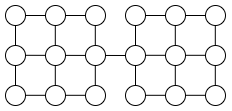

みなさん、道路は使っていますか？使っていますよね。

普段使っている道路ですが、災害時には使えなくなることもあります。道路が使えなくなると、物流に影響が出るなど大きな問題につながります。

一本の道路が使えなくなっても別の道路を迂回すれば大丈夫な場合もありますが、寸断されてしまう場合もあります。そのため、なるべく寸断されないような道路ネットワークを設計し、既存の道路ネットワークが堅牢かを評価する必要があります。

そういったことに行列木定理が役立つ！という話をします。

この記事は[木 Advent Calendar 2025](https://adventar.org/calendars/12007) の 2 日目の記事です。参加者を募集中です。

## グラフ理論

グラフとは頂点と辺からなるものです。ここでは頂点も辺も有限個であるグラフを考えます。

木とは連結グラフであってサイクルを含まないものです。

与えられたグラフの全域木とは、部分グラフであってすべての頂点を通り、木であるものをいいます。

## 行列木定理

全域木の個数が行列式から計算できるという行列木定理を紹介します。

グラフ $G$ の頂点に $1,2,\ldots,n$ と番号がついているとします。

次数行列 $D$ は、$(i,i)$ 成分が頂点 $i$ から出る辺の本数（次数）で、対角線上にない成分がすべて 0 である行列です。

隣接行列 $A$ は、頂点 $i$ と頂点 $j$ の間に辺があるとき $(i,j)$ 成分が 1、辺がないとき $(i,j)$ 成分が 0 となるような行列です。

グラフ $G$ のラプラシアンを $L=D-A$ とします。これらはすべて $n\times n$ 行列です。

ラプラシアン $L$ は可逆でないので、固有値 0 をもつことに注意します。


**定理** (行列木定理)

1. グラフ $G$ の全域木の個数は、ラプラシアン $L$ の任意の余因子と等しい。
2. $\det(tI_n+L)$ は $t$ の多項式であり、一次の係数を $c_1$ とおく。このとき、全域木の個数は $\frac{1}{n}c_1$ に等しい。
3. $L$ の固有値を $\lambda_1,\ldots,\lambda_n$ とする。ただし $\lambda_1=0$ とする。このとき、全域木の個数は $\frac{1}{n}\lambda_2\lambda_3\cdots \lambda_n$ に等しい。


## 道路ネットワークの評価

ここまで数学的な話でしたが、道路ネットワークに応用していきます。

道路ネットワークをグラフとして捉えます。どの道路が使用不可能となったときに影響が大きいでしょうか。例えば以下のグラフでは、中央の辺をなくすと連結でなくなってしまうため、非常に脆いです。

一つの解答として、辺を削除したときに全域木の個数がたくさん減る場合、その辺の重要度が高いと考えられます。

あるグラフの全域木の個数を $M$、辺 $e$ を除いたときの全域木の個数を $M_e$ としたとき、$(M-M_e)/M$ を辺 $e$ の重要度の評価とします。

実際にこの手法で石川県の道路ネットワークが評価されています。（参考文献を参照）

全域木中心性 (spanning tree centrality) という概念とも関連します。

## 他の手法

全域木の減少率を評価指標としましたが、ある辺の重要性を測る指標は他にもあります。

ラプラシアンの固有値は非負実数で、0 を固有値に持ちます。2 番目に小さい固有値 $\lambda_2$ について、$\lambda_2=0$ であることとグラフが非連結であることが同値であることが知られています。$\lambda_2$ の値が連結性の指標であると見ることができます。このことから、辺を削除することで $\lambda_2$ がどのように変化することを見ることで辺の重要性が評価できると考えられます。

様々な手法がありますが、辺の数が多いときに効率よく計算できるかという問題や、更新をうまく処理できるかという問題があります。

## おわりに

この記事ではラプラシアンと固有値を扱いました。このように固有値などを用いてグラフの性質を探る分野をスペクトルグラフ理論といいます。とてもホットな分野なので、私ももっと勉強したいです。

グラフ理論は様々な分野に応用されていることは知っていましたが、数学的な部分しか勉強したことがありませんでした。これからは応用にも目を向けていきたいです。

## 参考文献

- 光澤 駿治, 中山 晶一朗, 小林 俊一, 山口 裕通, 行列木定理を用いた道路ネットワーク評価方法の検討, 土木学会論文集D3 (土木計画学), Vol.76, No.5 (土木計画学研究・論文集第38巻), I_889-I_897, 2021.
- 吉田悠一, スペクトルグラフ理論, サイエンス社 (2024).