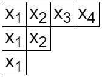



この記事は [Math Advent Calendar 2023](https://adventar.org/calendars/8530) の 19 日目の記事です。

線形代数を学んだばかりの学部 1 年生でも読めるように、線形代数の復習を入れつつ対称多項式を学んでいきます。

## 対称多項式

$R$ を可換環とします。環に馴染みがない人は $R$ は整数全体の集合 $\mathbb{Z}$ あるいは有理数全体の集合 $\mathbb{Q}$、または実数全体の集合 $\mathbb{R}$ と思ってよいです。

$x_1,\ldots,x_n$ を変数とする $R$ 係数多項式全体の集合を $R[x_1,\ldots,x_n]$ とします。

多項式 $f\in R[x_1,\ldots,x_n]$ が**対称多項式**であるとは、任意の $i,j \ (1\le i<j\le n)$ に対して $f$ の $x_i$ と $x_j$ を入れ替えたものが元の $f$ と等しくなることをいいます。このような対称多項式全体からなる集合を $\Lambda_n^R$ とおきます。$R$ を省略して $\Lambda_n$ と書くこともあります。

## 線形代数講義：線形空間

この集合 $\Lambda_n^R$ のもつ構造を考えます。

$f,g$ が対称多項式ならば、$f+g$ も対称多項式です。また、$c\in R$ に対して $cf$ も対称多項式です。このように、$\Lambda_n^R$ には和とスカラー倍という構造があります。このような構造を持つ集合を線形空間といいます。


注意：厳密には $R$ が体のときに線形空間といいます。$R$ が体とは限らない環のときは $R$ 加群と呼ばれることが多いです。


厳密には線形空間は次のように定義されます。$F$ を体とします ($\mathbb{Q},\mathbb{R}$ など)。集合 $V$ が $F$ **線形空間**であるとは次をみたすことをいいます。まず $V$ には $v,w\in V$ に対して $v+w$ という $V$ の元を対応させる演算（和）が定まっており、次をみたします。

- 任意の $u,v,w\in V$ に対して $(u+v)+w=u+(v+w)$
- ある $0\in V$ について、任意の $v\in V$ に対して $v+0=v$
- $v\in V$ に対して $-v\in V$ であって $v+(-v)=0$ をみたすものが存在
- 任意の $v,w\in V$ に対して $v+w=w+v$

さらに、$V$ には $v\in V, c\in F$ に対して $cv$ という $V$ の元を対応させる演算（スカラー倍）が定まっており、次をみたします。

- 任意の $c,d\in F, v\in V$ に対して $c(dv)=(cd)v$
- 任意の $v\in V$ に対して $1v=v$
- 任意の $c,d\in F, v\in V$ に対して $(c+d)v=cv+dv$
- 任意の $c\in F, v,w\in V$ に対して $c(v+w)=cv+cw$

これらをすべてみたすとき $V$ は $F$ 線形空間であるといいます。

例えば $\Lambda^{\mathbb{Q}}_n$ は $\mathbb{Q}$ 線形空間です。

$\Lambda_n$ は $f,g$ が対称多項式ならば積 $fg$ も対称多項式であるという性質も持ちます。これは線形空間よりも強い構造で、**代数**と呼ばれるものです。線形空間として考えるときには積は考えません。

## 単項・基本・完全・べき和対称多項式

例えばある対称多項式に $x_1^3x_2x_3$ という項が現れるとき、$x_1x_2^3x_3$ や $x_1x_2x_3^3$ も現れなければなりません。このような項をすべて集めて得られる対称多項式が**単項対称多項式**です。

$\lambda=(\lambda_1,\ldots,\lambda_n)$ を非負整数からなる広義単調減少列とします (これを**分割**といいます)。単項対称多項式 $m_{\lambda}(x_1,\ldots,x_n)$ は $x_1^{\lambda_1}\cdots x_n^{\lambda_n}$ および文字の入れ替えで得られる相異なる項の和として定義されます。例えば、$m_{(3,1,1)}(x_1,x_2,x_3)=x_1^3x_2x_3+x_1x_2^3x_3+x_1x_2x_3^3$ です。

次に $e_k(x_1,\ldots,x_n)=m_{(\underbrace{1,\ldots,1}_k)}(x_1,\ldots,x_n)$ とします。別の書き方をすると

$$
e_k(x_1,\ldots,x_n)=\sum_{1\le i_1<\cdots<i_k\le n}x_{i_1}\cdots x_{i_k}
$$

となります。また

$$
h_k(x_1,\ldots,x_n)=\sum_{1\le i_1\le\cdots\le i_k\le n}x_{i_1}\cdots x_{i_k}
$$

とおきます (不等号の違いに注意)。さらに

$$
p_k(x_1,\ldots,x_n)=\sum_{i=1}^nx_i^k
$$

とおきます。最後に

$$
\begin{align*}
e_{\lambda}(x_1,\ldots,x_n) &= e_{\lambda_1}(x_1,\ldots,x_n)\cdots e_{\lambda_n}(x_1,\ldots,x_n) \\\
h_{\lambda}(x_1,\ldots,x_n) &= h_{\lambda_1}(x_1,\ldots,x_n)\cdots h_{\lambda_n}(x_1,\ldots,x_n) \\\
p_{\lambda}(x_1,\ldots,x_n) &= p_{\lambda_1}(x_1,\ldots,x_n)\cdots p_{\lambda_n}(x_1,\ldots,x_n)
\end{align*}
$$

とおきます。これらはすべて対称多項式です。$e_{\lambda}$ を**基本対称多項式**、$h_{\lambda}$ を**完全対称多項式**、$p_{\lambda}$ を**べき和対称多項式**といいます。

## 線形代数講義：基底

$V$ を $F$ 線形空間とします。$V$ の元からなる有限集合 $X=\\{v_1,\ldots,v_n\\}$ を考えます。$c_1,\ldots,c_n\in F$ に対して $c_1v_1+\cdots+c_nv_n=0$ ならば $c_1=\cdots=c_n=0$ が成り立つとき、$X$ は**線形独立**であるといいます。一方、任意の $v\in V$ に対してある $c_1,\ldots,c_n\in F$ を用いて $v=c_1v_1+\cdots+c_nv_n$ と表せるとき、$X$ は $V$ の**生成系**であるといいます。線形独立かつ生成系であるとき、**基底**といいます。

基底に含まれる元の個数は一定です。この値を $V$ の**次元**と呼びます。$V$ が有限個の元からなる基底をもつとき有限次元であるといいます。

$\Lambda_n$ は有限次元線形空間ではありません。無限次元線形空間においても基底を定義しましょう。

線形空間 $V$ の元からなる集合 $B$ が $V$ の基底であるとは

- $B$ から有限個の元を選んだとき、それらは線形独立。
- 任意の $v\in V$ は、$B$ から有限個の元 $b_1,\ldots,b_n$ を選び、$c_1,\ldots,c_n\in F$ を選ぶことで $v=c_1b_1+\cdots+c_nb_n$ と表すことができる。

をみたすことをいいます。例えば一変数多項式全体の集合 $\mathbb{R}[x]$ において、$\\{1,x,x^2,x^3,\ldots\\}$ は基底です。

## $\Lambda_n$ の基底

$\lambda$ が長さ $n$ 以下の分割全体をわたるとき、$m_{\lambda}(x_1,\ldots,x_n)$ は $\Lambda_n^{\mathbb{Q}}$ の基底をなすことがわかります。

これより、$e_{\lambda}$ を $m_{\mu}$ の線形結合として表すことができます。係数を $M_{\lambda\mu}$ とおきます。すなわち

$$
e_{\lambda}=\sum_{\mu}M_{\lambda\mu}m_{\mu}
$$

です。この係数について考えます。そのために分割 $\lambda$ を**ヤング図形**を用いて表してみます。$i$ 行目に $\lambda_i$ 個の正方形を並べて得られる図形を $\lambda$ のヤング図形といいます。行と列の役割を入れ替えて得られる図形を**共役**といい、$\lambda^{\prime}$ で表します。

上の例では、左側は $(4,2,1)$ のヤング図形、右側は $(3,2,1,1)$ のヤング図形となっており、互いに共役の関係になっています。

さて、係数 $M_{\lambda\mu}$ は次の性質をみたします。


1. $\mu\gt_{\mathrm{lex}}\lambda^{\prime}$ ならば $M_{\lambda\mu}=0$. ここで $\gt_{\mathrm{lex}}$ は辞書式順序。
2. $M_{\lambda\lambda^{\prime}}=1$


証明します。$e_{\lambda_i}$ に含まれる単項式のうち辞書式順序で最も大きいものは $x_1x_2\cdots x_{\lambda_i}$ です。よって $e_{\lambda}=e_{\lambda_1}\cdots e_{\lambda_l}$ を展開するとき、辞書式順序で最も大きいものは $x_1^{\lambda^{\prime}_1}x_2^{\lambda^{\prime}_2}\cdots x_n^{\lambda^{\prime}_n}$ となります。また、この項の係数は 1 です。

(証明終わり)

この結果から、例えば

- $e_{(4)}=m_{(1,1,1,1)}$
- $e_{(3,1)}=m_{(2,1,1)}+(m_{(1,1,1,1)}の線形結合)$
- $e_{(2,2)}=m_{(2,2)}+(m_{(1,1,1,1)},m_{(2,1,1)}の線形結合)$
- $e_{(2,1,1)}=m_{(3,1)}+(m_{(1,1,1,1)},m_{(2,1,1)},m_{(2,2)}の線形結合)$
- $e_{(1,1,1,1)}=m_{(4)}+(m_{(1,1,1,1)},m_{(2,1,1)},m_{(2,2)},m_{(3,1)}の線形結合)$

のように表せます。このような性質を三角性といいます。この性質から

- $m_{(1,1,1,1)}=e_{(4)}$
- $m_{(2,1,1)}=e_{(3,1)}+(e_{(4)}の線形結合)$
- $m_{(2,2)}=e_{(2,2)}+(e_{(4)},e_{(3,1)}の線形結合)$
- $m_{(3,1)}=e_{(2,1,1)}+(e_{(4)},e_{(3,1)},e_{(2,2)}の線形結合)$
- $m_{(4)}=e_{(1,1,1,1)}+(e_{(4)},e_{(3,1)},e_{(2,2)},e_{(2,1,1)}の線形結合)$

と表すことができます。$(m_{\lambda})$ は $\Lambda_n$ の基底なので、$(e_{\lambda})$ は $\Lambda_n$ の生成系であることがわかります。$(m_{\lambda})$ と $(e_{\lambda})$ は元の個数が等しいので、$(e_{\lambda})$ が基底であることもいえます。

証明は省略しますが、$(h_{\lambda})$ と $(p_{\lambda})$ も $\Lambda_n$ の基底です。

## 線形代数講義：内積

高校数学では 2 つのベクトルが直交するかどうかを扱いました。ここで重要になるのが内積です。

内積をもつ線形空間を考えます。これを**計量線形空間**といいます。$F=\mathbb{R}$ とします。

$\mathbb{R}$ 線形空間 $V$ 上の内積とは $u,v\in V$ に対して $\langle u,v\rangle\in \mathbb{R}$ を対応させる写像であって次をみたすものです。

- 任意の $u,v,w\in V, c,d\in\mathbb{R}$ に対して $\langle cu+dv,w\rangle =c\langle u,w\rangle +d\langle v,w\rangle$
- 任意の $v\in V$ に対して $\langle v,v\rangle \ge 0$ であり、$\langle v,v\rangle =0$ と $v=0$ が同値。
- 任意の $u,v\in V$ に対して $\langle u,v\rangle=\langle v,u\rangle$

$\langle u,v\rangle=0$ をみたすとき、$u,v$ は直交するといいます。

$V$ の基底 $\\{v_1,\ldots,v_n\\}$ に対して $\langle v_i,v_j\rangle=\delta_{ij}$ をみたすとき、この基底は**正規直交基底**であるといいます。ここで

$$
\delta_{ij}=\begin{cases} 1 & (i=j) \\\ 0 & (i\ne j) \end{cases}
$$

はクロネッカーのデルタです。

## $\Lambda_n$ の内積

$(h_{\lambda}), (m_{\lambda})$ は $\Lambda_n$ の基底なので、次のように内積を定めることができます。

$$
\langle h_{\lambda},m_{\mu}\rangle=\delta_{\lambda\mu}
$$

一般の $u,v\in \Lambda_n$ に対する $\langle u,v\rangle$ は、$u$ を $h_{\lambda}$ の線形結合、$v$ を $m_{\mu}$ の線形結合で表し、内積の線形性を用いることで求められます。

## 線形代数講義：行列式

線形代数の主役ともいえる行列がまだ出てきていませんでした。

$n$ 次正方行列とは、$n$ 行 $n$ 列の形に数を配置したものです。例えば

$$
\begin{pmatrix}
1 & 2 \\\
3 & 4
\end{pmatrix}
$$

は 2 次正方行列です。長方形の形に並べることもありますが、この記事で扱うのは正方形のみです。

$A=(a_{ij})$ と書いたとき、$a_{ij}$ は行列 $A$ の上から $i$ 行目、左から $j$ 列目に書かれた数を表します。上の例では $a_{12}=2$ です。

$S_n$ を $\\{1,2,\ldots,n\\}$ から $\\{1,2,\ldots,n\\}$ への全単射全体からなる集合とします。

$n$ 次正方行列 $A=(a_{ij})$ の**行列式**を

$$
\det(A)=\sum_{\sigma\in S_n}\mathrm{sgn}(\sigma)a_{1\sigma(1)}a_{2\sigma(2)}\cdots a_{n\sigma(n)}
$$

により定義します。ここで $\mathrm{sgn}(\sigma)$ は $\sigma$ の符号であり、偶置換ならば $+1$、奇置換ならば $-1$ となります。(解説は省略させていただきます)

行列式は次の性質をみたします。ここで各 $\mathbf{a}_i$ は長さ $n$ の行ベクトルです。

$$
\det\begin{pmatrix} \mathbf{a}_1 \\\ \vdots \\\ k\mathbf{b}+l\mathbf{c} \\\ \vdots \\\ \mathbf{a}_n \end{pmatrix}
=k\det\begin{pmatrix} \mathbf{a}_1 \\\ \vdots \\\ \mathbf{b} \\\ \vdots \\\ \mathbf{a}_n \end{pmatrix}
+l\det\begin{pmatrix} \mathbf{a}_1 \\\ \vdots \\\ \mathbf{c} \\\ \vdots \\\ \mathbf{a}_n \end{pmatrix}
$$

$$
\det\begin{pmatrix} \mathbf{a}_1 \\\ \vdots \\\ \mathbf{a}_j \\\ \vdots \\\ \mathbf{a}_i \\\ \vdots \\\ \mathbf{a}_n \end{pmatrix}=-\det\begin{pmatrix}\mathbf{a}_1 \\\ \vdots \\\ \mathbf{a}_i \\\ \vdots \\\ \mathbf{a}_j \\\ \vdots \\\ \mathbf{a}_n\end{pmatrix}
$$

1 つ目の性質を多重線形性、2 つ目の性質を交代性といいます。

## シューア多項式

非負整数列 $\alpha=(\alpha_1,\ldots,\alpha_n)$ に対して $A_{\alpha}(x_1,\ldots,x_n)=\det(x_i^{\alpha_j}) _ {1\le i,j\le n}$ とおきます。行列式の交代性から、$A_{\alpha}(x_1,\ldots,x_n)$ において 2 変数を入れ替えると $-1$ 倍となります。

$\delta_n=(n-1,n-2,\ldots,1,0)$ とおきます。$\lambda+\delta_n$ を成分ごとの和とするとき、**シューア多項式**は

$$
s_{\lambda}(x_1,\ldots,x_n)=\frac{A_{\lambda+\delta_n}(x_1,\ldots,x_n)}{A_{\delta_n}(x_1,\ldots,x_n)}
$$

によって定義されます。2 変数を入れ替えると分母・分子がともに $-1$ 倍になり打ち消し合います。よってシューア多項式は対称です。あとは実際に多項式となることを確かめます。

$A_{\delta_n}(x_1,\ldots,x_n)$ は **Vandermonde 行列式**と呼ばれるものに等しく

$$
A_{\delta_n}(x_1,\ldots,x_n)=\prod_{1\le i<j\le n}(x_i-x_j)
$$

となることが知られています。これは多くの線形代数の本に載っていると思います。$A_{\lambda+\delta_n}(x_1,\ldots,x_n)$ は $x_i$ と $x_j$ を入れ替えると $-1$ 倍になることから、$(x_i-x_j)$ を因子に持ちます。よって $A_{\lambda+\delta_n}(x_1,\ldots,x_n)$ は $A_{\delta_n}(x_1,\ldots,x_n)$ で割り切れるので、シューア多項式 $s_{\lambda}(x_1,\ldots,x_n)$ は実際に多項式です。

シューア多項式を行列式により定義しましたが、組合せ論的に定義することもできます。$\lambda$ のヤング図形を再び考えます。ヤング図形の各マスに 1 以上 $n$ 以下の整数を書き込みます。これが**半標準ヤングタブロー**であるとは

1. 各行について広義単調増加
2. 各列について狭義単調増加

をみたすことをいいます。半標準ヤングタブロー $T$ に整数 $i$ が $\mu_i$ 個書かれているとき、$\mu=(\mu_1,\ldots,\mu_n)$ を $T$ のウェイトと呼びます。$\lambda$ 上の半標準ヤングタブローであってウェイトが $\mu$ であるものの個数 $K_{\lambda\mu}$ は**コストカ数**といいます。このとき

$$
s_{\lambda}(x_1,\ldots,x_n)=\sum_{\mu}K_{\lambda\mu}m_{\mu}(x_1,\ldots,x_n)
$$

が成り立ちます。この等式の証明は省略します。この等式をシューア多項式の定義として採用している文献もあります。

コストカ数は次の三角性をみたします。

1. $\mu\gt_{\mathrm{lex}}\lambda$ ならば $K_{\lambda\mu}=0$
2. $K_{\lambda\lambda}=1$

$(m_{\lambda})$ は $\Lambda_n$ の基底だったので、$(s_{\lambda})$ も $\Lambda_n$ の基底となることがわかります。

シューア多項式は基底であるのみならず、正規直交基底でもあります。すなわち $\langle s_{\lambda},s_{\mu}\rangle=\delta_{\lambda\mu}$ が成り立ちます。証明の概略を紹介します。まず、次の命題が成り立ちます。


$(u_{\lambda}),(v_{\lambda})$ がともに $\Lambda_n$ の基底であるとする。このとき次は同値である。
1. $\langle u_{\lambda}, v_{\mu}\rangle=\delta_{\lambda\mu}$
2. $\sum_{\lambda}u_{\lambda}(x_1,\ldots,x_n)v_{\lambda}(y_1,\ldots,y_n)=\prod_{i,j}(1-x_iy_j)^{-1}$


よって次の等式を示せばよいことになります。

$$
\sum_{\lambda}s_{\lambda}(x_1,\ldots,x_n)s_{\lambda}(y_1,\ldots,y_n)=\prod_{i=1}^n\prod_{j=1}^n\frac{1}{1-x_iy_j}
$$

この等式にはいくつか証明方法があります。一つは

$$
\det\left(\frac{1}{1-x_iy_j}\right)=\frac{A_{\delta_n}(x_1,\ldots,x_n)A_{\delta_n}(y_1,\ldots,y_n)}{\prod_{i,j=1}^n(1-x_iy_j)}
$$

という等式を用いる方法です。

もう一つは組合せ論的なシューア多項式の表示を用います。

$$
\sum_{\lambda}s_{\lambda}(x_1,\ldots,x_n)s_{\lambda}(y_1,\ldots,y_n)=\prod_{i=1}^n\prod_{j=1}^n\frac{1}{1-x_iy_j}
$$

の左辺における $x_1^{a_1}\cdots x_n^{a_n}y_1^{b_1}\cdots y_n^{b_n}$ の係数は、形がともに $\lambda$ でウェイトがそれぞれ $(a_1,\ldots,a_n),(b_1,\ldots,b_n)$ である半標準ヤングタブローの組の個数の、$\lambda$ に関する和に等しいです。一方右辺における $x_1^{a_1}\cdots x_n^{a_n}y_1^{b_1}\cdots y_n^{b_n}$ の係数は、等式

$$
\frac{1}{1-x_iy_j}=1+(x_iy_j)+(x_iy_j)^2+\cdots
$$

を考慮すると、$n$ 次正方行列であって

- 成分が非負整数
- $i$ 行目の成分の和が $a_i$
- $j$ 列目の成分の和が $b_j$

となるようなものの個数に等しいです。実は、形が等しい 2 つの半標準ヤングタブローの組からなる集合と非負整数成分の行列からなる集合との間に全単射が存在します。この全単射を具体的に記述するアルゴリズムがあり、RSK 対応と呼ばれています。気になった方はぜひ調べてみてください。

## おわりに

予定では固有値やマクドナルド多項式の話も入れる予定でしたが、間に合わなかったので後編で執筆する予定です。

証明をすべて丁寧に記載する予定でしたができませんでした。興味を持った方は参考文献を手に取ってみてください。

## 参考文献

- Egge, Eric S. An introduction to symmetric functions and their combinatorics. American Mathematical Society (2019).
- Macdonald, Ian Grant. Symmetric functions and Hall polynomials. 2nd ed. Oxford: Clarendon Press (1998).
- Noumi, Masatoshi. Macdonald Polynomials Commuting Family of $q$-Difference Operators and Their Joint Eigenfunctions, Springer (2023).
- 池田岳, テンソル代数と表現論, 東京大学出版会 (2022).
