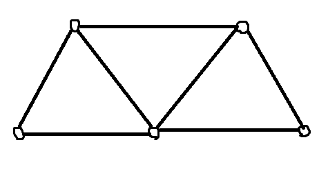

+++
title = "エルデシュの単位距離問題"
date = 2026-05-22
+++

平面上に $n$ 個の点を配置します。距離が 1 になる 2 点の組を最大でいくつにできるかという問題を考えます。

この問題を単位距離問題 (unit distance problem) といいます。エルデシュの問題の 90 番です。

この問題の答えを $u(n)$ とします。例えば点を $(1,0),(2,0),\ldots,(n,0)$ に配置すれば隣り合う 2 点の距離が 1 なので、$u(n)\ge n-1$ となります。少なくとも線形のオーダーであることがわかりました。

では、より精密に $u(n)$ を評価していきましょう。

## 下界

まずはエルデシュ自身の結果を紹介します。

座標が 0 以上 $\lfloor \sqrt{n}\rfloor-1$ 以下の正方形を考え、格子点に点を配置します。ある $m<n$ を選んで、距離が $\sqrt{m}$ であるような 2 点がたくさん存在するようにしたいです。このとき適当に縮小することで距離が 1 であるような 2 点がたくさん存在することになります。

おおむね次のような流れになります。

- $n$ 以下の正の整数で、素因数がすべて $4k+1$ 型であるものを考える。
- $n$ 以下の $4k+1$ 型の素数の個数を評価する。（素数定理の一般化）
- $m=a^2+b^2$ をみたす $(a,b)$ の個数がおよそ $n^{c/\log\log n}$ である。
    - すなわち原点から距離 $\sqrt{m}$ の点の個数が $n^{c/\log\log n}$ である。
- 平行移動がおよそ $n$ 通り。
- 以上より、距離が $\sqrt{m}$ である 2 点が $n^{1+c/\log\log n}$ 通り以上存在する。

すなわち

$$
u(n)\ge n^{1+c/\log\log n}
$$

が得られました。

線形よりも多いですが、$1/\log\log n$ の部分は小さくなります。

エルデシュは次のように予想しました。

$$
u(n)\le n^{1+o(1)}
$$

$n^{1.01}$ のような指数関数的オーダーではないという予想です。

## 反証

2026 年 5 月 20 日、OpenAI より論文が発表されました。

[An OpenAI model has disproved a central conjecture in discrete geometry](https://openai.com/index/model-disproves-discrete-geometry-conjecture/)

これは上述の予想の反例を与えるものです。すなわち、ある $\delta>0$ が存在して $u(n)$ が少なくとも $n^{1+\delta}$ のオーダーとなることを証明しました。

AI が生成した元々の証明では $\delta$ の具体的な値については触れられていませんでしたが、数学者の検証によって $\delta=0.014114$ ととれることがわかりました。

エルデシュの構成では素数定理といった解析的整数論の手法が使われていますが、この反例では代数的整数論の道具が使われています。

証明の詳細は読んでいません。証明を理解できたとき、加筆または新規記事を執筆するかもしれません。

## 上界

下からの評価について書きましたが、上からの評価についてはどうでしょうか。

平面上の $n$ 個の点を頂点とし、距離が 1 である 2 点の間に辺を張ってグラフを作ります。

このグラフにはどのような特徴があるでしょうか。

2 頂点 $v,w$ を選びます。このとき、$v,w$ の両方と辺で結ばれている頂点は 2 個以下です。なぜなら、そのような点は $v,w$ を中心とした半径 1 の円周の交点だからです。

別の言い方をすると、このグラフは完全二部グラフ $K_{2,3}$ を部分グラフとして含みません。

このように、あるグラフを含まないグラフについて考える問題があります。完全グラフの場合はトゥランの定理が知られています。完全二部グラフの場合、Kővári–Sós–Turán の定理が知られています。


**定理**: $n$ 頂点グラフであって、完全二部グラフ $K_{s,t} \ (s\le t)$ を含まないようなグラフの辺の最大値を $\mathrm{ex}(n,K_{s,t})$ とすると

$$
\mathrm{ex}(n,K_{s,t})=O(n^{2-1/s})
$$

をみたす。


これを unit distance problem に用いると、$K_{2,3}$ が現れないということだったので、辺の個数は $O(n^{1.5})$ です。辺は距離 1 の 2 点に対応していたので、$u(n)=O(n^{1.5})$ が得られました。

現在知られている最良の上界は Spencer, Szemerédi, Trotter による $u(n)=O(n^{4/3})$ です。こちらの証明も理解したいです。

$u(n)$ のオーダーは $n^{1.014114}$ と $n^{4/3}$ の間であることが現在の最先端です。正確なオーダーがわかる日を心待ちにしています。

## distinct distance problem との関係

エルデシュの unit distance problem と、同じくエルデシュの distinct distance problem の関係を見ます。

平面上 $n$ 個の点を配置したとき、距離の種類数の最小値 $d(n)$ はいくつかという問題を distinct distance problem といいます。

$u(n)d(n)\ge \binom{n}{2}$ です。これは距離の種類数が $d(n)$ となる配置において、各距離を実現する 2 点の組の個数が $u(n)$ 以下であることから従います。

$u(n)=O(n^{4/3})$ と合わせると、$d(n)=\Omega(n^{2/3})$ がわかります。

$d(n)$ について知られている最良の評価は Guth-Katz によるもので、$\Omega(n/\log n)$ です。証明には多項式ハムサンドイッチの定理を用いるようで、これも気になります。

## おわりに

最近あまりアウトプットをできていませんでしたが、数学の魅力的な話題をお届けしていきたいです。

取り上げられなかった話題も多くあるので、いずれ加筆するかもしれません。

## 参考文献

- Szemerédi, Endre. Erdős’s unit distance problem. Nash, John Forbes jun. (ed.) et al., Open problems in mathematics. Cham: Springer. 459-477 (2016).
- Zhao, Yufei. Graph theory and additive combinatorics. Exploring structure and randomness. Cambridge University Press (2023).